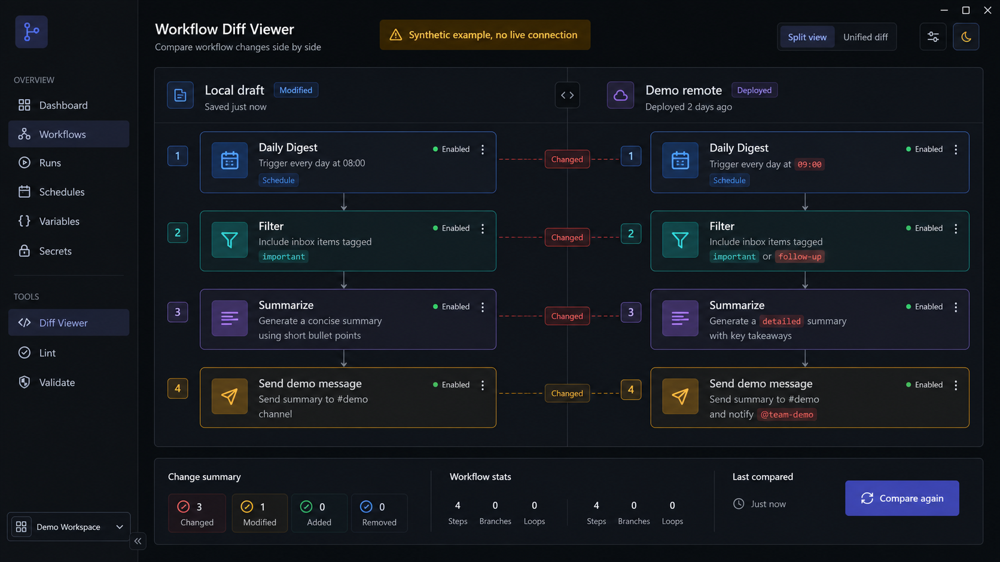

# n8n Utilities

## Problem

n8n workflows are difficult to review safely when their live instance data, credentials, and execution history should remain private.

## What this toolkit does

These local helper scripts back up workflows from configured n8n instances, compare local and remote JSON, show a local diff view, support credential migration, inspect execution logs, and manage workflow activation.

## Public-safe scope

The repository publishes tooling and redacted visual evidence. It does not publish instance URLs, API keys, workflow exports, credentials, execution data, or production configuration. Copy the supplied environment-file template before using a local instance.

## How it works

1. Configure local credentials in an ignored `.env.n8n` file.
2. Export workflows into a local project root.
3. Check status, inspect a targeted diff, and review the JSON locally.
4. Push only after manual review, or use the utilities to query executions and change activation state.

The [main project README](n8n_extract_sync_2026_03_11/README.md) documents commands, state handling, and local workflows.

## Visual evidence

The diff-viewer image uses redacted example workflow names and content. It contains no live instance URL, credential, or workflow identifier.

*Redacted example of the local diff viewer used to compare an exported workflow with a configured instance.*

## Repository layout

The main tooling lives in `n8n_extract_sync_2026_03_11/`:

- back up workflows from one or more n8n instances
- compare local and remote workflow JSON
- review diffs in a small local UI
- migrate or copy credentials
- query execution logs and activate or deactivate workflows
- run scheduled sync jobs and test helpers

## Repo layout

- `n8n_extract_sync_2026_03_11/` - main project folder with the actual scripts
- `n8n_extract_sync_2026_03_11/CHEATSHEET.md` - quick commands
- `n8n_extract_sync_2026_03_11/REFERENCE.md` - env vars and behavior notes
- `docs/changelog.md` - lightweight repo notes

## Basic setup

1. Use Python 3.10+.
2. Use Node 18+ if you want to run the Playwright-based diff tests.
3. Copy `n8n_extract_sync_2026_03_11/secrets/.env.n8n.example` to your local `.env.n8n` file and fill in the n8n credentials.

## Notes

- The repository is intentionally small and public-safe.
- Most usage details live in the subproject README and cheatsheet.

## Workflow-mirror Git configuration

Scheduled-sync and workflow-mirror Git setup belongs in the workflow-mirror repository, where its `.gitattributes` rule and operator documentation live. This utilities repository does not contain workflow backups or their merge configuration.

## Start here

- [Main project README](n8n_extract_sync_2026_03_11/README.md)
- [Cheatsheet](n8n_extract_sync_2026_03_11/CHEATSHEET.md)
