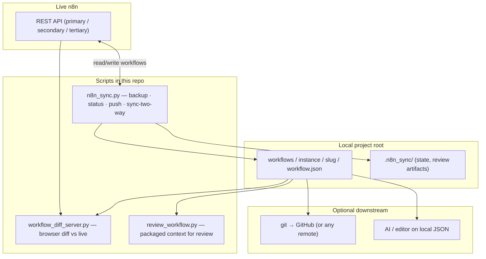
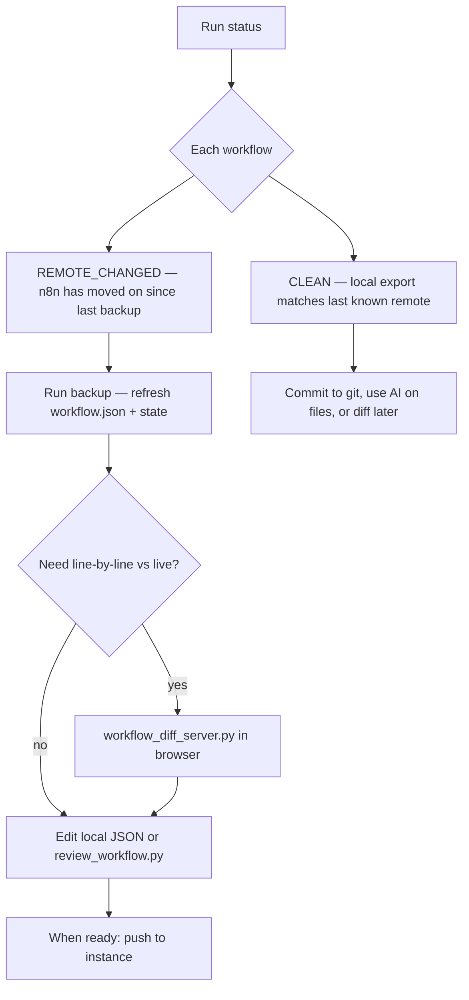

# n8n Extract Sync (Python)

Python tooling in this repo to **back up, compare, and push** n8n workflow JSON exports (multi-instance: primary / secondary / tertiary).

## How the pieces fit together

Your **project root** (where `workflows/` and `.n8n_sync/` live) is the hub: exports from live n8n land there, you compare and optionally edit, then you can push back to n8n and/or treat that tree as normal source for git and AI-assisted review.



**Checking instance vs local:** `status` compares each workflow’s **recorded remote snapshot** (in `.n8n_sync`) to what n8n reports now. `workflow_diff_server.py` compares **file contents** on disk to the **current** remote JSON for one workflow—useful when `status` shows `REMOTE_CHANGED` or before a `push`.



## Quick links

- **[CHEATSHEET.md](CHEATSHEET.md)** — copy-paste commands (`n8n_sync.py`, cred copy, diff server, Playwright, review).
- **[REFERENCE.md](REFERENCE.md)** — environment variables, dotenv paths, pruning behavior, workflow ID casing, credential migration limits, troubleshooting notes.
- **[2026_03_27_windows_task_scheduler_setup.md](2026_03_27_windows_task_scheduler_setup.md)** — Windows Task Scheduler setup for isolated mirror sync plus dual telemetry: direct Supabase sync tables and the shared n8n webhook stream.

## Setup

1. Copy `secrets/.env.n8n.example` to `secrets/.env.n8n` and add API keys (see REFERENCE for variable names and examples).
2. Use **Python 3.10+**.
3. Run scripts from **your project root** (the directory containing `workflows/` and `.n8n_sync/`), not from inside this folder.
4. Point `--dotenv` to wherever your `.env.n8n` lives (default: `secrets/.env.n8n` relative to your project root); details in REFERENCE.

## Common command

Back up all workflows from all configured instances:

```bash
python ..\n8n_utilities_2026\n8n_extract_sync_2026_03_11\scripts\n8n_sync.py --mode backup --instance all --dotenv ./secrets/.env.n8n
```

Archived workflows are skipped during backup. If a workflow was backed up earlier and is now archived in n8n, the next real `backup` run will prune its local mirror and state record.

Check workflow sync status for one instance:

```bash
python ..\n8n_utilities_2026\n8n_extract_sync_2026_03_11\scripts\n8n_sync.py --mode status --instance primary --dotenv ./secrets/.env.n8n
```

Example output with dummy workflow names:

```text
workspace root: C:\Users\harsh\Documents\n8n_workflows_2026_01_25
  ✓ primary  ok

▸ primary  │  3 workflows  │  status
  ────────────────────────────────────────────────────────
      CLEAN  ○ Daily Sales Summary
             2026-03-27 09:25  61995f0fea9c  -> workflows\primary\daily_sales_summary_abcd1234\workflow.json
  REMOTE_CHANGED  ○ CRM Lead Enrichment
             2026-03-27 09:49  87691a03ebe4  -> workflows\primary\crm_lead_enrichment_efgh5678\workflow.json
      CLEAN  ○ Weekly Support Digest
             2026-03-26 10:32  90e2d278b720  -> workflows\primary\weekly_support_digest_ijkl9012\workflow.json

  1 remote_changed, 2 clean
```

`CLEAN` means the local exported workflow matches the latest remote version for that instance. `REMOTE_CHANGED` means the remote workflow has changed since the last local export, so you should run `backup` before reviewing or pushing changes.

Review one workflow in the local diff viewer:

```bash
python ..\n8n_utilities_2026\n8n_extract_sync_2026_03_11\scripts\workflow_diff_server.py --instance primary --workflow-id 87691a03ebe4
```

Example startup output:

```text
workspace root: C:\Users\harsh\Documents\n8n_workflows_2026_01_25
Diff review server running at http://127.0.0.1:8765 (instance=primary, workflow=87691a03ebe4)
```

Open `http://127.0.0.1:8765` in your browser to compare the local exported JSON against the current remote workflow for that workflow ID. This is the quickest way to inspect what changed after `status` shows `REMOTE_CHANGED`.

Redacted example screenshot:

Redacted diff viewer screenshot

For dry-run, push, status, diff UI, and tests, use the cheatsheet.
